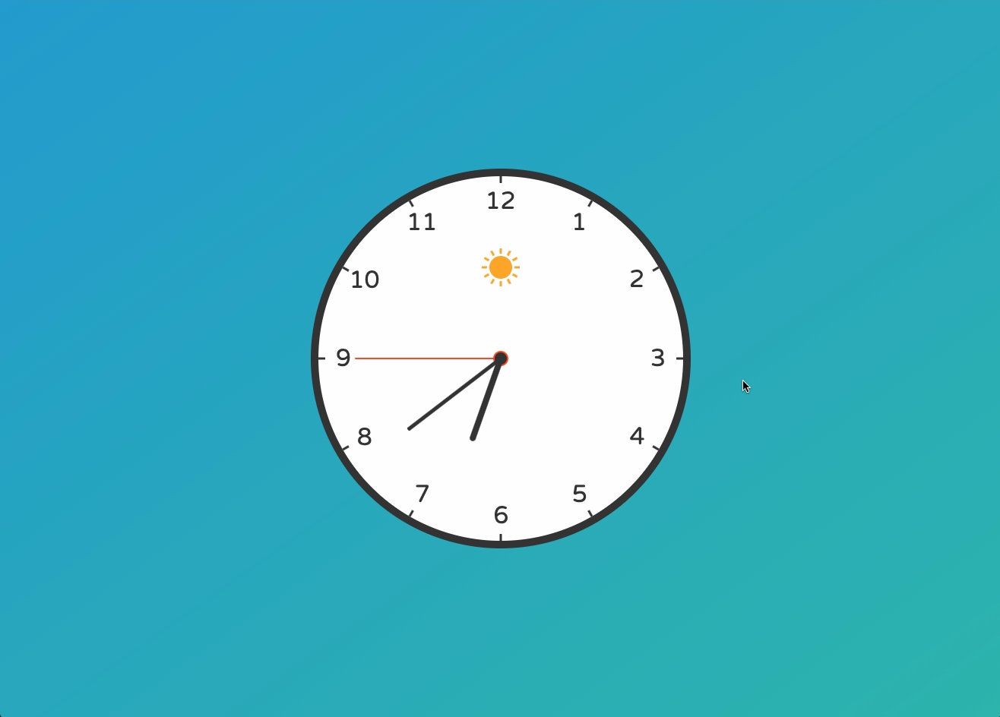
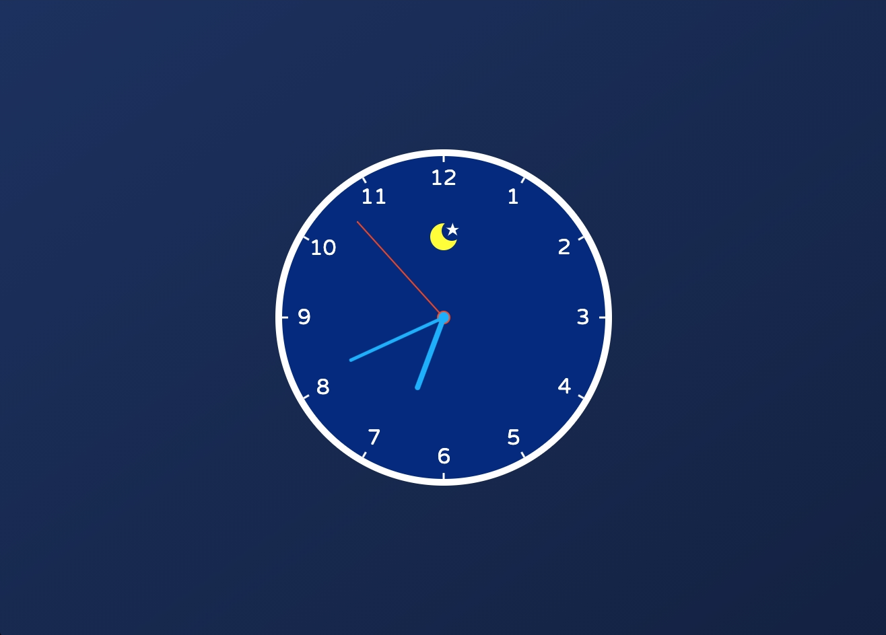

# JavaScript-Project_Analog-Clock
This is a project originally from <a href="https://github.com/WebDevSimplified/JavaScript-Clock">WebDevSimplified</a>. I rewrote the JavaScript part on my own after I learnt how to do it. Also, I added sun mode and moon mode to the clock.

Live site: https://jasontwuk.github.io/JavaScript-Project_Analog-Clock/

<b>This clock will show its sun mode between 06:00 and 18:00.</b>

<b>This clock will show its moon mode after 18:00 and before 06:00.</b>

